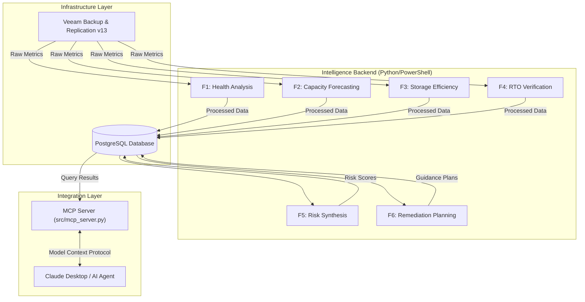

# DR365V2 Intelligent MCP Server for Veeam B&R v13

✅ **Status: Production Ready** | 🧩 **Veeam API: v1.3** | 🖥️ **Platform: Windows & PostgreSQL**

## 🚀 Executive Summary

**DR365V2** is a headless, AI-native **Backup Risk Intelligence Platform** specifically architected for **Veeam Backup & Replication v13**. It transforms raw backup data into actionable operational intelligence through a unified, six-stage pipeline.

The platform relies on a standardized API layer known as the **Model Context Protocol (MCP)** to expose its intelligence. While it can serve any MCP-compliant agent, it is optimized for **Claude Desktop**, allowing administrators to engage with an AI Agent to ask complex questions like *"Why is the SQL backup failing?"* or *"Draft a remediation plan for my capacity issues"* and receive grounded, real-time intelligence in return.

---

## 📂 Comprehensive Project Structure

Below is the exhaustive file structure of the project, representing the production layout `c:\DR365\DR365V2`.

```plaintext
DR365V2/
├── .env                                  # [SECRETS] Environment variables (Veeam/DB Creds)
├── README.md                             # Master documentation (this file)
├── requirements.txt                      # Python dependencies (pandas, psycopg2, etc.)
├── setup_all_scheduled_tasks.ps1         # MASTER DEPLOYMENT: Registers all Windows Tasks
│
├── db/                                   # Database Schema Definitions
│   ├── dr365v.sql                        # Risk Analysis & Remediation Tables (F5/F6)
│   └── dr365v_metrics.sql                # Raw Metrics & Forecasting Tables (F1-F4)
│
├── DOCS/                                 # Technical Implementation Guides
│   ├── FEATURE 01 IMPLEMENTATION.md      # Deep Dive: Health Metrics
│   ├── FEATURE 02 IMPLEMENTATION.md      # Deep Dive: Capacity Forecasting
│   ├── FEATURE 03 IMPLEMENTATION.md      # Deep Dive: Storage Efficiency
│   ├── FEATURE 04 IMPLEMENTATION.md      # Deep Dive: Recovery & RTO
│   ├── FEATURE 05 IMPLEMENTATION.md      # Deep Dive: Risk Synthesis
│   └── FEATURE 06 IMPLEMENTATION.md      # Deep Dive: Remediation Engine
│
├── src/                                  # Application Source Code
│   ├── mcp_server.py                     # [CORE INTERFACE] The MCP Server for AI Agents
│   │
│   ├── common/
│   │   └── auth.py                       # Shared Veeam OAuth2 Authentication Logic
│   │
│   ├── database/
│   │   └── db.py                         # PostgreSQL Connection Pooling & Utilities
│   │
│   ├── feature1/                         # [F1] HEALTH METRICS
│   │   ├── feature1.py                   # Logic: Health Scoring, Trend Analysis
│   │   ├── collect_sessions.ps1          # PWSH: Hybrid Session Collection
│   │   └── config.yaml                   # Config: History days, Scoring weights
│   │
│   ├── feature2/                         # [F2] CAPACITY FORECASTING
│   │   ├── feature2.py                   # Logic: Polynomial Regression, Outliers
│   │   └── config.yaml                   # Config: Safety buffers, Thresholds
│   │
│   ├── feature3/                         # [F3] STORAGE EFFICIENCY
│   │   ├── feature3.py                   # Logic: Anomaly Detection, Optimization
│   │   ├── get_efficiency_data.ps1       # PWSH: Low-level storage metrics
│   │   ├── setup_automation.py           # Setup: Automation helper
│   │   ├── run_efficiency_collection.bat # Batch: Execution wrapper
│   │   └── config.yaml                   # Config: Efficiency targets
│   │
│   ├── feature4/                         # [F4] RECOVERY VERIFICATION
│   │   ├── feature4.py                   # Logic: RTO % calculation, Confidence
│   │   ├── get_restore_history.ps1       # PWSH: Restore session history
│   │   ├── get_surebackup_results.ps1    # PWSH: SureBackup detailed extraction
│   │   └── config.yaml                   # Config: SLA definitions
│   │
│   ├── feature5/                         # [F5] RISK ANALYSIS
│   │   ├── feature5.py                   # Logic: Risk weighting, Cascade detection
│   │   └── business_context_config.yaml  # Config: VM Tiering Regex, Risk Weights
│   │
│   └── feature6/                         # [F6] REMEDIATION GUIDANCE
│       ├── feature6.py                   # Logic: Remediation Strategy Engine
│       └── config.yaml                   # Config: Safety limits, Read-only flags
```

---

## 🏗️ System Architecture

The system operates on a "Hub and Spoke" architecture where the central hub is a PostgreSQL database enriched by autonomous background workers, and the interface is an on-demand MCP Server.



### Core Design Principles
1.  **Dependency Awareness**: Feature 5 (Risk) explicitly validates the "freshness" of Feature 1-4 data. If inputs are stale, it flags a "Staleness Cascade" and degrades its own confidence score.
2.  **Safety First**: Feature 6 (Remediation) is purely advisory. It writes plans to the database but has **no network access** to write back to the VBR server.
3.  **Enterprise Observability**: All actions, errors, and performance metrics are logged structurally to the database for full auditability.

---

## 🔌 Interface Integration: Claude Desktop

DR365V2 is designed to be "headless" but highly interactive via AI. The standard implementation uses **Claude Desktop** connected via MCP.

### Configuration
Add this entry to `%APPDATA%\Claude\claude_desktop_config.json`:

```json
{
  "mcpServers": {
    "dr365": {
      "command": "C:\\Users\\Administrator\\AppData\\Local\\Programs\\Python\\Python314\\python.exe",
      "args": [
        "-u",
        "C:\\DR365\\DR365V2\\src\\mcp_server.py"
      ],
      "cwd": "C:\\DR365\\DR365V2",
      "env": {
        "PYTHONPATH": "C:\\DR365\\DR365V2\\src",
        "PYTHONUTF8": "1",
        "PYTHONIOENCODING": "utf-8",
        "PYTHONUNBUFFERED": "1"
      }
    }
  }
}
```

### Available Capabilities (Tools)
Once connected, the AI Agent gains the following capabilities:

| Tool Name | Feature Source | Capability Description |
| :--- | :--- | :--- |
| `get_health_status` | **Feature 1** | Retrieve health scores, failure trends, and job history. |
| `get_capacity_forecast` | **Feature 2** | Forecast storage exhaustion dates and view utilization trends. |
| `get_efficiency_metrics` | **Feature 3** | Analyze deduplication/compression ratios and optimization potential. |
| `get_recovery_performance` | **Feature 4** | View RTO percentiles, SureBackup results, and SLA gaps. |
| `analyze_risks` | **Feature 5** | Get a prioritized, weighted list of infrastructure risks (Critical/High). |
| `get_remediation_plan` | **Feature 6** | Generate a safe, step-by-step remediation guide for a specific risk. |

---

## 🛠️ Step-by-Step Installation & Deployment

### 1. Prerequisites
*   **OS**: Windows Server 2019/2022.
*   **Veeam**: VBR v12/v13 with REST API enabled.
*   **DB**: PostgreSQL 13+ (Local or Remote).
*   **Runtimes**: Python 3.10+, PowerShell 7+ (Core).
*   **Modules**: `Install-Module -Name Veeam.Backup.PowerShell`

### 2. Environment Setup
Create `c:\DR365\DR365V2\.env`:
```ini
VEEAM_SERVER=localhost
VEEAM_USERNAME=your_service_account
VEEAM_PASSWORD=your_password
DB_HOST=localhost
DB_PORT=5432
DB_NAME=dr365v_metrics
DB_USER=postgres
DB_PASSWORD=your_db_password
```

### 3. Database Initialization
This project uses a **Dual Database Architecture**: one for raw metrics and one for synthesized risk intelligence.

```powershell
# 1. Create Metrics Database (Features 1-4)
createdb -U postgres dr365v_metrics
psql -U postgres -d dr365v_metrics -f "c:\DR365\DR365V2\db\dr365v_metrics.sql"

# 2. Create Risk Database (Features 5-6)
createdb -U postgres dr365v
psql -U postgres -d dr365v -f "c:\DR365\DR365V2\db\dr365v.sql"
```

### 4. Install Dependencies
```powershell
pip install -r requirements.txt
```

### 5. Deploy Background Workers
This automated script registers the required Windows Scheduled Tasks to keep the data fresh.
```powershell
cd c:\DR365\DR365V2
.\setup_all_scheduled_tasks.ps1
```

### 6. Verify Operation
1. Open **Task Scheduler** > **DR365V2**.
2. Run `DR365_Feature1_Health` manually.
3. Check `c:\DR365\DR365V2\logs` (created automatically) for execution details.

### 7. Manual Execution Reference
You can run any feature manually for debugging or on-demand updates. Ensure you are in the project root `C:\DR365\DR365V2`.

| Feature | Description | Command |
| :--- | :--- | :--- |
| **Feature 1** | Health Metrics | `python src\feature1\feature1.py` |
| **Feature 2** | Capacity Forecast | `python src\feature2\feature2.py` |
| **Feature 3** | Storage Efficiency | `python src\feature3\feature3.py` |
| **Feature 4** | Recovery RTO | `python src\feature4\feature4.py` |
| **Feature 5** | Risk Analysis | `python src\feature5\feature5.py` |
| **Feature 6** | Remediation Plan | `python src\feature6\feature6.py` |


---

## 📚 Technical Documentation Index

For profound "Deep Dive" details on the algorithms, database schemas, and implementation logic of each feature, refer to the guides in the `DOCS` folder:

*   📊 **Feature 1**: Health Metrics & Historical Analysis
*   🔮 **Feature 2**: Capacity Exhaustion Forecasting
*   💾 **Feature 3**: Storage Efficiency & Anomaly Detection
*   🛡️ **Feature 4**: Recovery Verification & RTO Analysis
*   🧠 **Feature 5**: Advanced Risk Analysis & Compliance
*   📋 **Feature 6**: Actionable Recommendations & Remediation

---

**© 2026 DR365V2 Project Team** | *AI-Native Intelligence for Veeam*
