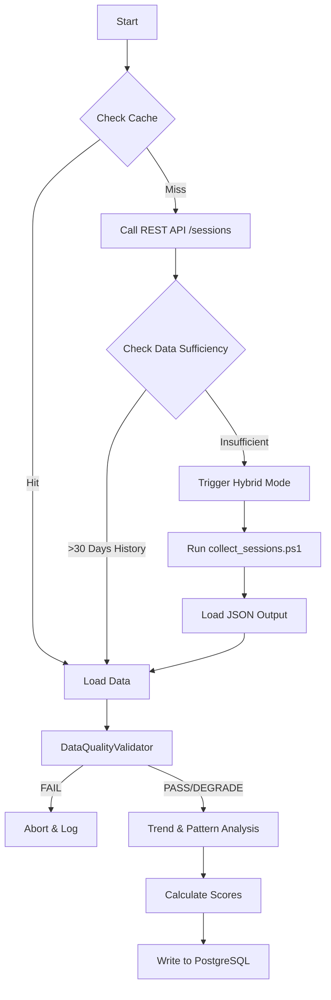

# FEATURE 01: HEALTH METRICS & HISTORICAL ANALYSIS - TECHNICAL IMPLEMENTATION

## 1. SYSTEM ARCHITECTURE

**Feature Name:** Health Metrics & Historical Analysis
**Namespace:** `src.feature1`
**Status:** Production (v2.0)
**Execution Entry:** `feature1.py` -> `main()`

### 1.1 Technical Components
The feature is architected as a modular pipeline of 5 specialized classes:

1.  **`VeeamAPIClient`**: Handles OAuth2.0, pagination, and retries.
2.  **`CacheManager`**: Implements filesystem-agnostic in-memory caching (12h TTL).
3.  **`DataQualityValidator`**: Statistical gatekeeper that accepts/rejects data for scoring.
4.  **`TrendAnalyzer` & `PatternRecognizer`**: The analytical engines using `numpy` and `scipy`.
5.  **`ScoreCalculator`**: Deterministic scoring engine based on weighted averages.
6.  **`DatabaseWriter`**: Handles transactional writes to PostgreSQL.

### 1.2 Data Flow Pipeline


---

## 2. KEY ALGORITHMS & LOGIC

### 2.1 Hybrid Data Collection Strategy
**Problem:** The Veeam REST API often returns limited history (defaults to 24h or 7 days) causing "Insufficient Data" errors.
**Solution:** A fallback mechanism that switches to PowerShell only when necessary.

*Implementation Logic (`main()`):*
1.  Fetch `/api/v1/sessions` (Start Date = Now - 90 Days).
2.  Calculate `span_days = max_date - min_date`.
3.  **Trigger Condition:** IF `sessions_count == 0` OR `span_days < 30`:
    *   **Action:** Execute `subprocess.run(["pwsh", "-File", "src/feature1/collect_sessions.ps1", "-Days", "90"])`.
    *   This script bypasses API limits by querying the VBR server directly via PowerShell.
4.  Result: A seamless 90-day dataset regardless of API limitations.

### 2.2 Data Quality Verification (`DataQualityValidator.validate`)
Before any math occurs, the dataset is vetted against 6 strict rules.

| Check ID | Rule | Implementation Criteria | Flag Raised |
| :--- | :--- | :--- | :--- |
| **Sample Size** | Minimum Samples | `len(sessions) < 30` | `INSUFFICIENT_DATA` (Fatal) |
| **Frequency** | Grid Density | `samples / days < 0.33` | `SPARSE_DATA` |
| **Variance** | Stability | `numpy.std(success_rates) > 0.50` | `HIGH_VARIANCE` |
| **Dominance** | Sample Bias | `max(single_job_count) / total > 0.80` | `SINGLE_JOB_DOMINATES` |
| **Span** | Historical Reach | `(max_date - min_date).days < 30` | `INSUFFICIENT_TIMESPAN` |
| **Integrity** | Metadata | `>5%` of sessions missing timestamps | `INCOMPLETE_METADATA` |

*Effect:* 
- **Fatal Flags**: Abort processing completely.
- **Warning Flags**: Reduce `confidence_level` (High -> Moderate -> Low) which impacts the final `risk_analysis` in Feature 5.

### 2.3 Trend Analysis Logic (`TrendAnalyzer`)
We use a sophisticated "Same-Weekday" comparison to avoid false alarms caused by weekly full backups (which usually take longer or have different success profiles).

**Algorithm:**
1.  **Rolling Average**: Calculate 7-day rolling mean of daily success rates to smooth noise.
2.  **Seasonal Detection**: 
    *   *Month-End Surge*: Checks days 26-31. If `other_days_success - month_end_success > 0.20`, tags `MONTH_END_SURGE`.
    *   *Weekend Pattern*: Checks `weekday >= 5`.
3.  **Same-Weekday Comparison (The "Smart" Check)**:
    *   Groups data by weekday (e.g., all Mondays).
    *   Splits into First 1/3 and Last 1/3.
    *   Calculates % change specifically for that weekday.
    *   *Why?* Solves the issue where "Mondays always fail" looks like a general downward trend.
4.  **Significance Testing**: Uses `scipy.stats.ttest_ind` (p < 0.05) to confirm if the change is statistically real or just random noise.

### 2.4 Pattern Recognition (`PatternRecognizer`)
Classifies failures into actionable types using statistical concentration.

*   **CONSISTENT_WEEKDAY**:
    *   Formula: `max(weekday_counts) / total_failures >= 0.70`
    *   Meaning: 70% of failures happen on the same day (e.g., "Always fails on Tuesdays").
*   **CONSISTENT_TIME**:
    *   Formula: `max(hour_counts) / total_failures >= 0.60`
    *   Meaning: 60% of failures happen in the same hour window.
*   **INTERMITTENT_REGULAR**:
    *   Formula: `std(gaps) / mean(gaps) < 0.30`
    *   Meaning: The time *between* failures is consistent (e.g., "Fails exactly every 5 days").

### 2.5 Scoring Engine (`ScoreCalculator`)
The `overall_score` (0-100) is a weighted sum.

**Component Weights:**
- `failure_rate` (35%): The raw success/fail ratio.
- `trend` (25%): Reward for improving, penalty for degrading.
- `pattern` (20%): Penalty for randomness (harder to fix), reward for consistency (easier to fix).
- `protected_objects` (10%): Validation of object accessibility.
- `repository` (10%): Infrastructure health.

**Math Specifics:**
- **Success Rate** = `(SuccessCount + (0.5 * WarningCount)) / TotalSessions`
- **Penalty Logic**:
    - If `failure_count > 10`: `score -= (failure_count - 10) * 0.5` (Max 10 point penalty).
    - If `correlated_failures` (3+ jobs failing simultaneously): `pattern_score -= 15`.

---

## 3. DATABASE SCHEMA REFERENCE

### 3.1 `feature1.metrics_health_score` (Master Table)
| Column | Type | Purpose |
| :--- | :--- | :--- |
| `overall_score` | NUMERIC(5,2) | Final score (e.g., 87.50) |
| `grade` | CHAR(1) | 'A', 'B', 'C', 'D', 'F' |
| `quality_flags` | JSONB | Stores validation failures (e.g., `["HIGH_VARIANCE"]`) |
| `confidence_multiplier` | NUMERIC | Derived from Quality checks (1.0, 0.8, 0.5) |

### 3.2 `feature1.metrics_job_failures` (Detail Table)
| Column | Type | Purpose |
| :--- | :--- | :--- |
| `job_id` | VARCHAR | Link to Veeam Job |
| `priority` | VARCHAR | Derived from failure rate (CRITICAL if <50% success) |
| `pattern_classification` | VARCHAR | e.g., 'CONSISTENT_WEEKDAY' |

---

## 4. INTEGRATION & OUPUT INTERFACE

**Dependencies:**
- `numpy`: Vectorized math for variances and means.
- `pandas`: Time-series handling.
- `scipy`: T-test for statistical significance.

**Metadata Output (for Feature 5):**
Feature 1 generates a `ValidationResult` object which is serialized to `quality_flags` column. Feature 5 reads this to determine if it should trust the risk assessment.
```json
{
  "status": "DEGRADE",
  "confidence_level": "MODERATE",
  "validation_flags": ["SPARSE_DATA"],
  "quality_checks": {
    "sample_count_ok": true,
    "frequency_ok": false,
    "variance_ok": true
  }
}
```

---

## 5. OPERATION & CONFIGURATION

### 5.1 Manual Execution
To run this feature manually (e.g., for debugging or immediate updates), execute the following from the project root:

```powershell
python src\feature1\feature1.py
```
*Note: This will trigger the Hybrid Collector (`collect_sessions.ps1`) automatically.*

### 5.2 Configuration
*   **Credentials**: Managed via `.env` file (VEEAM_SERVER, DB_HOST, etc).
*   **Parameters**: Managed via `src\feature1\config.yaml`.
    *   `days_to_analyze`: Window size for trend analysis (default: 30).
    *   `min_sessions`: Minimum data points required for valid scoring (default: 30).
    *   `weights`: Tuning for the scoring algorithm.

