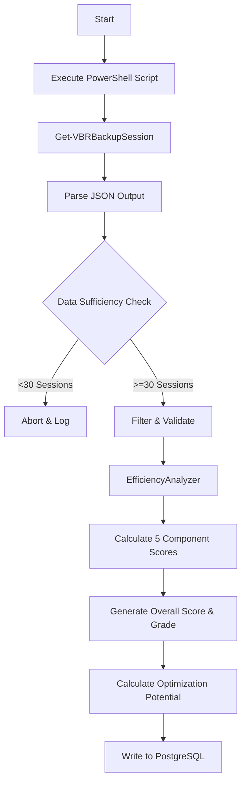

# FEATURE 03: STORAGE EFFICIENCY ANALYSIS - TECHNICAL IMPLEMENTATION

## 1. SYSTEM ARCHITECTURE

**Feature Name:** Storage Efficiency Analysis (Hybrid Mode)
**Namespace:** `src.feature3`
**Status:** Production (v2.0)
**Execution Entry:** `feature3.py` -> `main()`

### 1.1 Technical Components
The feature uses a **Hybrid Architecture** because the Veeam REST API v1.0 does not expose deduplication ratios. We bridge this gap using a PowerShell collector.

1.  **`PowerShellEfficiencyCollector`**:
    *   Wraps `get_efficiency_data.ps1`.
    *   Executes `Get-VBRBackupSession` to fetch strictly typed efficiency metrics (`DedupeRatio`, `CompressionRatio`).
2.  **`EfficiencyAnalyzer`**:
    *   The core statistical engine.
    *   Calculates 5 distinct scores (Dedup, Compression, Trend, Consistency, Anomaly).
3.  **`DatabaseWriter`**:
    *   Persists scores to `metrics_storage_efficiency`.
    *   Persists raw history to `storage_efficiency_history`.

### 1.2 Data Flow Pipeline


---

## 2. KEY ALGORITHMS & LOGIC

### 2.1 Hybrid Data Collection
**Problem:** REST API v1.x lacks `dedupeRatio` and `compressionRatio` in the `/sessions` endpoint.
**Solution:**
*   Python calls `subprocess.run(["pwsh", "-File", "get_efficiency_data.ps1", ...])`.
*   PowerShell accesses the .NET object `Veeam.Backup.Model.CBackupSession.BackupStats`.
*   Data is returned as structured JSON for Python to process.

### 2.2 The 5-Component Scoring Model
The system calculates a weighted average `overall_score` (0-100).

| Component | Weight | Logic / Calculation |
| :--- | :--- | :--- |
| **Deduplication** | 30% | `Combined Score = 90+` if >3.5x (Excellent), `75+` if >2.5x (Good). Linear interpolation between thresholds. |
| **Compression** | 25% | `Combined Score = 90+` if >2.0x (Excellent), `75+` if >1.8x (Good). |
| **Trend** | 20% | `t-test` (p < 0.05). If degrading >5%, penalize score. If improving, boost score. |
| **Consistency** | 15% | `100 - (Coefficient of Variation * 200)`. Rewards low variance. |
| **Anomaly** | 10% | `100` if 0 anomalies. Penalizes based on `%` of anomalous sessions using 3-sigma. |

**Final Grade:**
*   A (≥85), B (≥70), C (≥55), D (≥40), F (<40).

### 2.3 Optimization Potential Calculation
Quantifies "Money on the Table" (wasted storage).
*   `Current Storage = Raw / (CurrentDedup * CurrentComp)`
*   `Target Storage = Raw / (2.5 * 1.8)`  *(Targeting "Good" benchmarks)*
*   `Potential Savings = Current Storage - Target Storage`
*   **Monetization**: `Annual Savings = (Monthly GB * 12 / 1024) * $100/TB`.

### 2.4 Anomaly Detection (`detect_anomalies`)
Identifies sudden drops in efficiency that might indicate configuration changes (e.g., someone turned off dedup).
*   **Method**: Z-Score (Standard Score).
*   **Threshold**: `3.0` Sigma (Standard Deviations).
*   **Logic**: `z = (value - mean) / std_dev`.
*   **Criticality**: If value drops > 20% below mean, it's flagged as `CRITICAL_ANOMALY`.

---

## 3. DATABASE SCHEMA REFERENCE

### 3.1 `feature3.metrics_storage_efficiency` (Scorecards)
| Column | Type | Purpose |
| :--- | :--- | :--- |
| `overall_score` | NUMERIC | The final weighted 0-100 score. |
| `efficiency_rating`| VARCHAR | EXCELLENT, GOOD, FAIR, POOR. |
| `optimization_potential_gb` | NUMERIC | Daily GB that could be saved. |
| `projected_monthly_savings_gb` | NUMERIC | `potential * 30`. |
| `trend_classification` | VARCHAR | IMPROVING, STABLE, DEGRADING. |
| `quality_flags` | JSONB | e.g., `{"CRITICAL_ANOMALIES": true}`. |

### 3.2 `feature3.storage_efficiency_history` (Raw Data)
| Column | Type | Purpose |
| :--- | :--- | :--- |
| `dedup_ratio` | NUMERIC | Raw ratio from PowerShell (e.g., 3.4). |
| `compression_ratio`| NUMERIC | Raw ratio (e.g., 1.8). |
| `combined_ratio` | NUMERIC | `dedup * compression`. |
| `is_anomaly` | BOOLEAN | Flagged if >3 sigma. |

---

## 4. INTEGRATION & OUPUT INTERFACE

**Dependencies:**
*   `numpy`: Means, Standard Deviations.
*   `scipy.stats`: T-tests for trend significance.
*   `subprocess`: To drive PowerShell.

**Metadata Output (for Feature 5):**
Generates detailed `quality_flags` for Risk Analysis:
```json
{
  "CRITICAL_ANOMALIES": true,
  "DEGRADING_TREND": true,
  "HIGH_VARIANCE": false
}
```
If `DEGRADING_TREND` is true, Feature 5 increases the Risk Score significantly.

---

## 5. OPERATION

### 5.1 Manual Execution
```powershell
python src\feature3\feature3.py
```
*Note: This automatically invokes `get_efficiency_data.ps1` via the hybrid collector.*

### 5.2 Security Configuration
*   **Credentials**: Loaded from `.env` file.
*   **PowerShell Script**: `get_efficiency_data.ps1` uses the Veeam PowerShell module (no separate auth required if running on VBR server).

