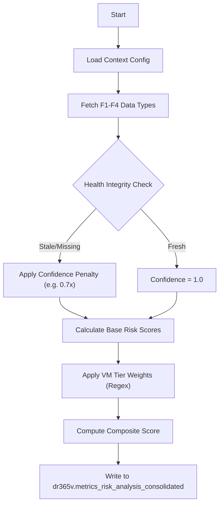

# FEATURE 05: RISK CONSOLIDATION & COMPLIANCE - TECHNICAL IMPLEMENTATION

## 1. SYSTEM ARCHITECTURE

**Feature Name:** Advanced Risk Analysis & Prioritization (Synthesis Engine)
**Namespace:** `src.feature5`
**Status:** Production (v2.0) - Verified with Dual Database Architecture
**Execution Entry:** `feature5.py` -> `Feature5RiskAnalysisEngine.run_analysis()`

### 1.1 Technical Components
Feature 5 differs from Features 1-4 as it is a **pure synthesis engine**. It does not query the Veeam API directly. Instead, it aggregates, validates, and weights data already stored in PostgreSQL by the previous features.

1.  **`Feature5RiskAnalysisEngine`**:
    *   **Orchestrator**: Loads `business_context_config.yaml`.
    *   **Data Fetcher**: Pulls the *latest* single record for every job from F1, F2, F3, and F4 tables.
2.  **`FeatureHealthCheck`**:
    *   **Gatekeeper**: Validates the "Freshness" and "Quality" of input data before using it.
    *   **Logic**: If Feature 1 data is >24 hours old, it degrades the confidence of the final Risk Score rather than failing outright.
3.  **`ConsolidatedRiskCalculator`**:
    *   **Scoring**: Applies the weighted formula defined in config.
    *   **Business Context**: Applies multipliers based on VM Tier (CRITICAL vs LOW).

### 1.2 Data Flow Pipeline


---

## 2. KEY ALGORITHMS & LOGIC

### 2.1 The Weighted Risk Formula
The `Composite Risk Score` (0-100) is calculated using strict weights defined in `business_context_config.yaml`.

**Formula:**
```python
BaseScore = (
    JobFailureRisk * 0.25 + 
    CapacityRisk * 0.25 + 
    EfficiencyRisk * 0.15 + 
    RecoveryRisk * 0.20 + 
    DataQualityRisk * 0.15
)
FinalScore = BaseScore * OverallConfidenceMultiplier
```

### 2.2 VM Tier Classification (Regex Engine)
The system automatically classifies jobs based on their names using Regular Expressions.

| Tier | Weight | Patterns (Regex) |
| :--- | :--- | :--- |
| **CRITICAL** | 1.00 | `^PROD-`, `SQL-PROD`, `ERP`, `Critical` |
| **HIGH** | 0.75 | `^APP-`, `Exchange`, `Finance` |
| **MEDIUM** | 0.50 | `^DEV-`, `FileServer`, `General` |
| **LOW** | 0.25 | `^TEST-`, `Archive`, `Temp` |

*   **Logic**: A `CRITICAL` VM with a Risk Score of 80 results in a **Business Impact** of 80 (80 * 1.0).
*   **Logic**: A `LOW` VM with a Risk Score of 80 results in a **Business Impact** of 20 (80 * 0.25).

### 2.3 Staleness & Cascade Detection
Feature 5 implements "Cascade Detection" to prevent bad data from propagating.
*   **Scenario**: Feature 1 (Health) ran 48 hours ago. Feature 2 (Capacity) ran 1 hour ago.
*   **Detection**: `_detect_staleness_cascades()` flags this discrepancy.
*   **Action**: The system tags the record with `STALENESS_CASCADE_F1_F2` and reduces the confidence multiplier, warning the user that the Capacity Forecast might be based on old health data.

---

## 3. DATABASE SCHEMA REFERENCE

### 3.1 `dr365v.metrics_risk_analysis_consolidated` (Note: Different Schema `dr365v`)
| Column | Type | Purpose |
| :--- | :--- | :--- |
| `composite_risk_score` | INTEGER | The final 0-100 score shown in dashboards. |
| `business_impact_score` | INTEGER | The score adjusted by VM Tier weight. |
| `overall_data_confidence` | DECIMAL | The multiplier (0.3 - 1.0) indicating data trust. |
| `risk_category` | VARCHAR | CRITICAL / HIGH / MEDIUM / LOW. |
| `quality_flags` | JSON/ARRAY | List of issues (e.g. `["sample_count_low", "data_stale"]`). |
| `vm_tier` | VARCHAR | The classified Tier based on job name. |

---

## 4. INTEGRATION INTERFACE

**Dependencies:**
*   **Inputs**:
    *   `feature1.metrics_health_score`
    *   `feature2.metrics_capacity_forecast`
    *   `feature3.metrics_storage_efficiency`
    *   `feature4.metrics_recovery_verification`
*   **Config**: `business_context_config.yaml` (Strictly required).

**Output for Dashboards:**
*   Queries should sort by `business_impact_score DESC` to show the "Money Risks" first.
*   UI should visually gray out or flag rows where `overall_data_confidence < 0.7`.

---

## 5. OPERATION

### 5.1 Manual Execution
```powershell
python src\feature5\feature5.py
```

### 5.2 Security Configuration
*   **Credentials**: Loaded from `.env` file (DB_HOST, DB_USER, DB_PASSWORD).
*   **Dual Database Architecture**: 
    *   Reads from `dr365v_metrics` (Features 1-4 data).
    *   Writes to `dr365v` (Risk database).
*   **Business Context**: Configured via `business_context_config.yaml` (VM tier patterns, risk weights).

