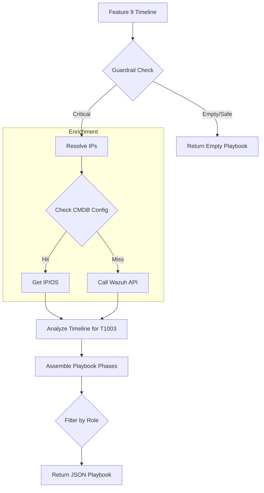

# FEATURE 10: ADVISORY PLAYBOOKS - TECHNICAL IMPLEMENTATION

## 1. SYSTEM ARCHITECTURE

**Feature Name:** Advisory Response Playbooks
**Namespace:** `src.feature10`
**Status:** Production (v2.0)
**Execution Entry:** `feature_10.py` -> `generate_response_playbook()`

### 1.1 Technical Components
1.  **`PlaybookGenerator`**: Logic engine for assembling steps.
2.  **`ConfigLoader`**: Loads the extensive Playbook Templates (Text/Commands).
3.  **`WazuhConnector`**: (Optional) Used for Agent IP address resolution if the local CMDB lookup fails.

### 1.2 Data Flow Pipeline


---

## 2. KEY ALGORITHMS & LOGIC

### 2.1 Credential Theft Detection
The timeline is scanned for MITRE technique `T1003` (Credential Access).
*   **IF Found**: A dedicated "Credential Rotation" phase is added to the playbook.
*   **Actions**: "Rotate Service Accounts", "Force Password Reset".

### 2.2 CMDB Simulation (Hostname Resolution)
To generate actionable firewall commands (`isolate_host_192.168.1.50`), we need IP addresses.
1.  **Local Map**: Checks `config.yaml` for hardcoded Critical Asset mappings (Simulation).
2.  **Fallback**: Calls Wazuh API `/agents?search={name}` to get IP/OS dynamically.

### 2.3 Role-Based Views
To prevent information overload:
*   **SOC Role**: Receives all phases + Specific CLI commands (SOAR IDs).
*   **Finance Role**: Receives only "Recovery Guidance" and High-Level "Containment Status". Technical Forensics steps are hidden.

---

## 3. CONFIGURATION

### 3.1 `config.yaml`
Located at `src/feature10/config.yaml`.
Contains the **Text Content** of the playbooks to allow editing without code changes.

```yaml
feature10:
  phases:
    immediate_containment:
      actions:
        network_isolation:
          soar_id_template: "SOAR_PLAYBOOK_ID: isolate_host_{ip}"
    forensic_preservation:
      actions:
        memory_dump_windows:
          tool: "DumpIt.exe"
```
