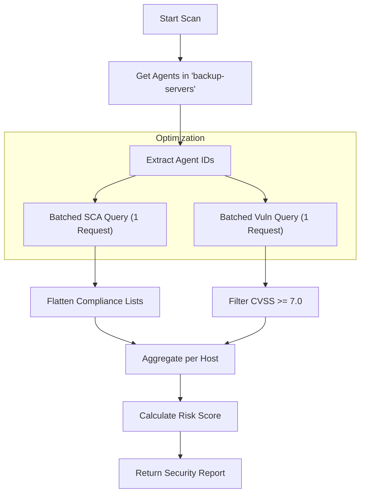

# FEATURE 11: SECURITY SCANNING - TECHNICAL IMPLEMENTATION

## 1. SYSTEM ARCHITECTURE

**Feature Name:** Backup Infrastructure Security Scanning
**Namespace:** `src.feature11`
**Status:** Production (v2.0)
**Execution Entry:** `feature_11.py` -> `scan_backup_security()`

### 1.1 Technical Components
1.  **`SecurityScanner`**: Main class for orchestration.
2.  **`WazuhConnector`**: Executes Batched Indexer Queries.
3.  **`ConfigLoader`**: Loads Target Group (`backup-servers`) and Weights.

### 1.2 Data Flow Pipeline


---

## 2. KEY ALGORITHMS & LOGIC

### 2.1 Batched Query Optimization
To prevent N+1 performance issues when scanning 100+ backup agents:
*   **Logic**: Uses Elasticsearch `terms` query.
    ```json
    "terms": { "agent.id": ["001", "002", "003"...] }
    ```
*   **Result**: Reduces HTTP calls from `N` to `2` (One for SCA, One for Vuln).

### 2.2 Compliance Flattening
Legacy Wazuh agents sometimes return compliance fields as nested lists: `[["PCI", "ISO"]]`.
Feature 11 normalizes this to a simple flat list `["PCI", "ISO"]` to ensure Feature 12 works correctly.

### 2.3 Risk Scoring Analysis
A weighted formula determines the overall Infrastructure Risk (0-100).
*   **Base Risk**: 20 (Baseline)
*   **SCA Penalties**: +5 per failure (Max 30).
*   **Vuln Penalties**: +10 per Critical/High Vuln (Max 50).
*   **Cap**: 100.

---

## 3. CONFIGURATION

### 3.1 `config.yaml`
Located at `src/feature11/config.yaml`.
*   `backup_agent_group`: "backup-servers"
*   `weights`: Defines penalties.
*   `wazuh`: Contains explicit API/Indexer connection details for stability.

### 3.2 Output Schema
```json
{
  "risk_score": 60,
  "findings": {
    "001": {
      "sca_failures": [{"check_id": "cis_1.1", "compliance": ["PCI"]}],
      "vulnerabilities": [{"cve": "CVE-2023-1234", "cvss": 9.8}]
    }
  }
}
```
