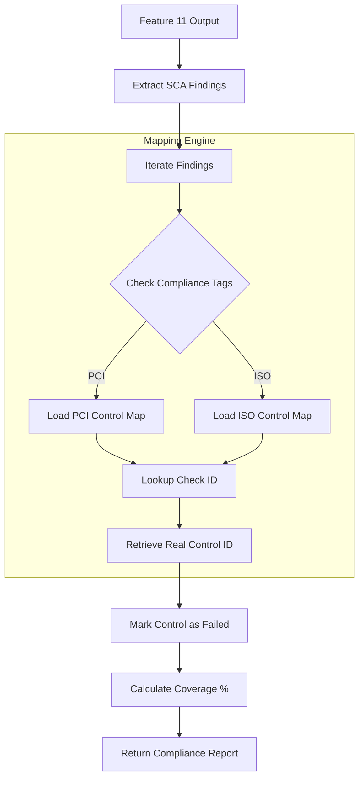

# FEATURE 12: COMPLIANCE MAPPING - TECHNICAL IMPLEMENTATION

## 1. SYSTEM ARCHITECTURE

**Feature Name:** Automated Compliance Mapping
**Namespace:** `src.feature12`
**Status:** Production (v2.0)
**Execution Entry:** `feature_12.py` -> `map_compliance_gaps()`

### 1.1 Technical Components
1.  **`ComplianceMapper`**: The logic engine that correlates technical findings to regulatory text.
2.  **`ConfigLoader`**: Loads the massive `compliance_frameworks` dict (PCI, NIST, ISO).
3.  **`WazuhConnector`**: Used only for Agent Name enrichment if F11 input lacks it.

### 1.2 Data Flow Pipeline


---

## 2. KEY ALGORITHMS & LOGIC

### 2.1 Framework Matching (Fuzzy Logic)
Since Wazuh compliance tags vary (`PCI`, `pci_dss`, `PCI DSS`), the mapper uses string containment matching against the keys in `config.yaml`.
*   Example: Tag "PCI DSS" matches Config Key "PCI".

### 2.2 Control ID Resolution
The core value prop is converting technical IDs to Auditor-friendly Regulation IDs.
*   **Input**: `backup_guest_account` (Wazuh Rule ID).
*   **Map**: `backup_guest_account` -> `PCI DSS 2.2`.
*   **Output**: "Control 2.2 Failed".

### 2.3 Coverage Calculation
Per Framework:
`Coverage % = (Passing Controls / Total Controls) * 100`
*   Total Controls: Defined in `config.yaml`.
*   Failing Controls: Unique Set of failed IDs (Deduplicated).

---

## 3. CONFIGURATION

### 3.1 `config.yaml`
Located at `src/feature12/config.yaml`.
This is the "Golden Source" of regulatory truth.
```yaml
feature12:
  compliance_frameworks:
    PCI:
      name: "PCI DSS v4.0"
      controls:
        backup_guest_account: "PCI DSS 2.2"
        cis_passwd_history: "PCI DSS 8.2.1"
    NIST:
      name: "NIST SP 800-53"
      controls:
        backup_guest_account: "NIST AC-2"
```

### 3.2 Output Schema
```json
{
  "compliance_report": {
    "PCI": {
      "coverage_percentage": 66.7,
      "status": "AT RISK",
      "failing_checks": [
        {"control_id": "PCI DSS 2.2", "title": "Guest Account Enabled"}
      ]
    }
  }
}
```
